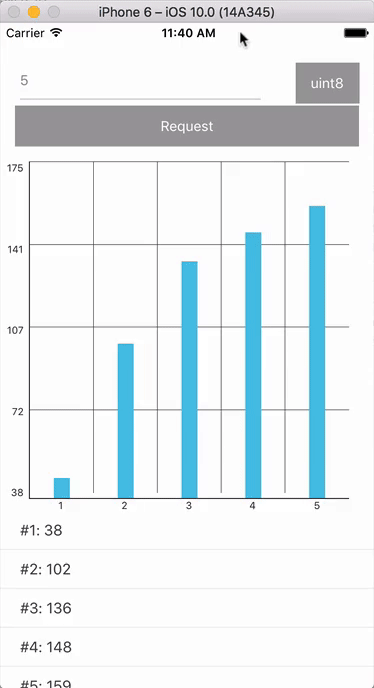

Environment Setup:
    [React Native](http://facebook.github.io/react-native/docs/getting-started.html#content)

Running Project:
    1. Clone the project
    2. run `npm install`
    3. run `react-native link`
    4. Run using the following instructions

To run your app on iOS:
   cd WebQem_RN
   react-native run-ios
   - or -
   Open WebQem_RN/ios/WebQem_RN.xcodeproj in Xcode
   Hit the Run button

To run your app on Android:
   Have an Android emulator running (quickest way to get started), or a device connected
   cd WebQem_RN
   react-native run-android

Project Time Estimate:
    1 1/2 hour.

Project Note:
Actual time: 1 hour 50 minutes.
- Encountered [iOS App Transport Security Issue](https://facebook.github.io/react-native/releases/0.28/docs/known-issues.html#ios-app-transport-security-and-loading-http-resources), that's why it took much longer to complete project.
- react-native-chart does not allow to different color for each bar of the bar chart, may be able to another library if different color is a fixed requirement.
